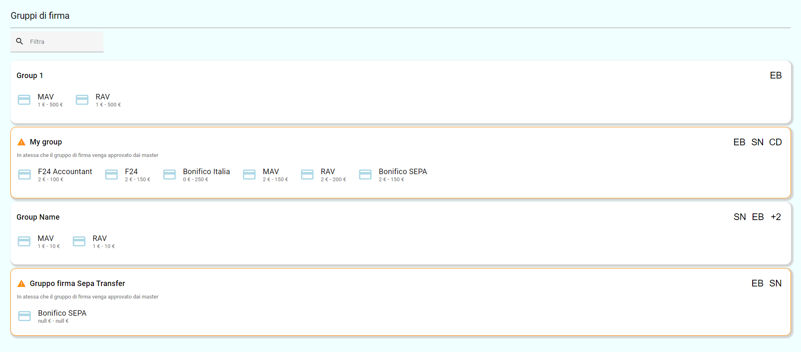
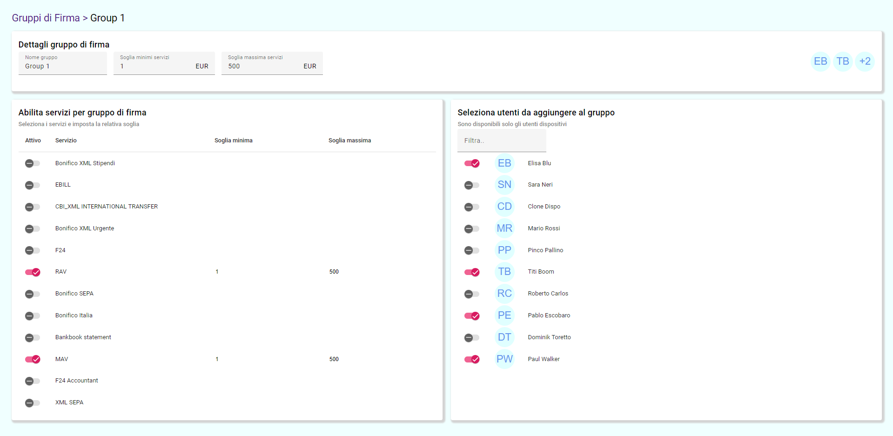

# GruppiDiFirma

This project was generated with [Angular CLI](https://github.com/angular/angular-cli) version 17.2.3.

## Development server

Run `ng serve` for a dev server. Navigate to `http://localhost:4200/`. The application will automatically reload if you change any of the source files.

## Project Overview

This is a pure Angular app that uses data binding and some controls. It has two screens:

- The main screen displays all existing data

- The second screen can be opened by modifying any of the items

All the modifications apply to the objects in real time and are rendered instantly. They get stored in local data and can be transferred to server if needed.